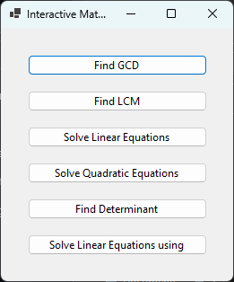

# Interactive Math Solver

Interactive Math Solver is a Windows Forms application that provides tools for solving various mathematical problems, including finding the greatest common divisor (GCD), least common multiple (LCM), solving linear equations, solving quadratic equations, finding determinants, and solving linear equations using Cramer's Rule.

## Features

- Find the Greatest Common Divisor (GCD) of two or more numbers.
- Find the Least Common Multiple (LCM) of two or more numbers.
- Solve linear equations with one or more variables.
- Solve quadratic equations and find their roots.
- Calculate the determinant of a square matrix.
- Solve systems of linear equations using Cramer's Rule.

## Getting Started

To use Interactive Math Solver, follow these steps:

1. Clone the repository to your local machine: `git clone https://github.com/Sayemchy2801/InteractiveMathSolver.git`
2. Open the solution file (`InteractiveMathSolver.sln`) in Visual Studio.
3. Build the solution to compile the application.
4. Run the application by clicking the "Start" button in Visual Studio or by running the generated executable.

## Usage

1. Launch the Interactive Math Solver application.
2. Choose one of the available math problems to solve by clicking the corresponding button on the main form.
3. Follow the instructions provided in the specific problem-solving form.
4. Input the required values or coefficients for the problem.
5. Click the "Solve" or "Calculate" button to get the result.
6. The result will be displayed in the output area of the form.

## Contributing

Contributions are welcome! If you find any issues or have suggestions for improvement, please open an issue or submit a pull request on the [GitHub repository](https://github.com/Sayemchy2801/InteractiveMathSolver).

## License

This project is licensed under the [MIT License](LICENSE).

## Contact

For any inquiries or questions, please contact Sayemchy at sc1383@canterbury.ac.uk.

